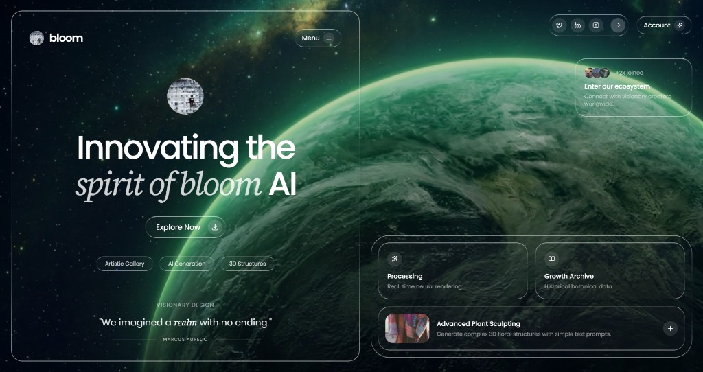
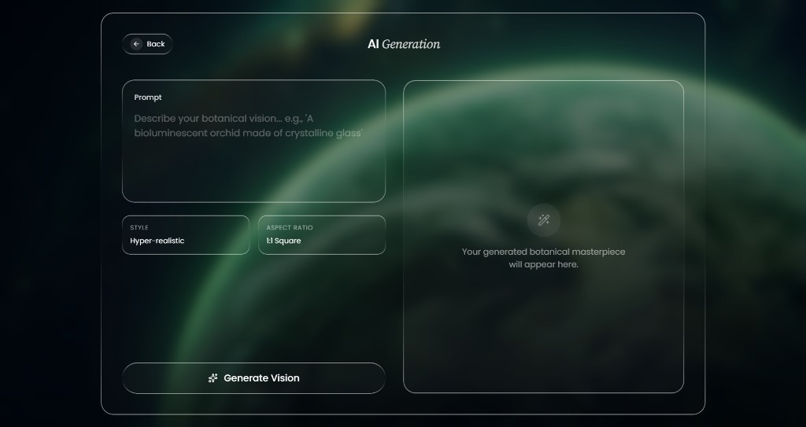
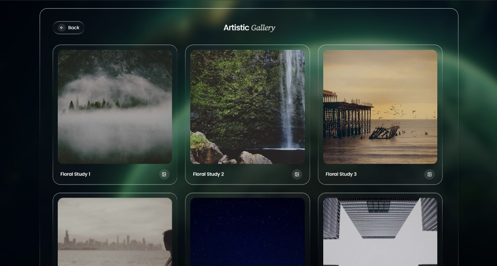
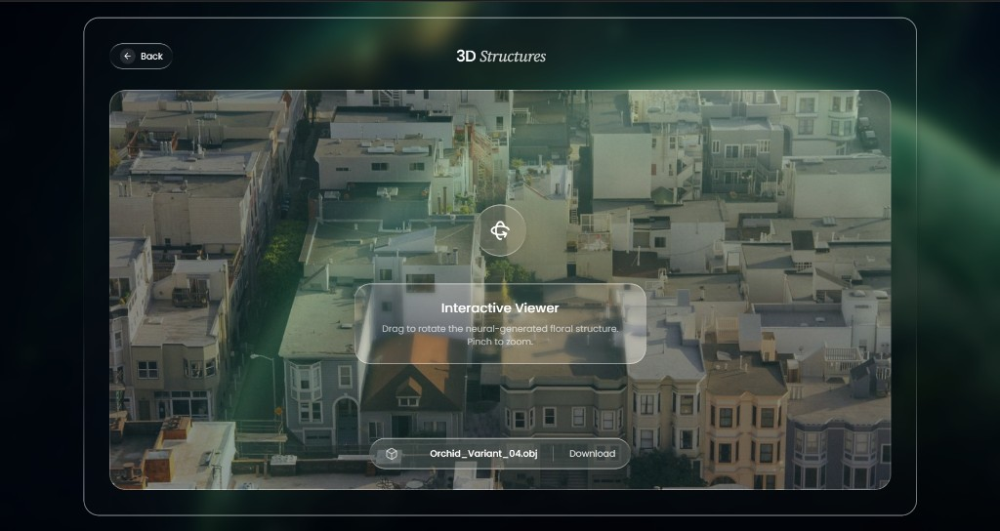

# Bloom

**A front-end concept — botanical dark-glass UI, motion, and multi-route product surfaces.**

[](LICENSE)
[](https://react.dev/)
[](https://vitejs.dev/)
[](https://www.typescriptlang.org/)
[](https://tailwindcss.com/)

**[Live site](https://wilo101.github.io/bloom-ui/)** · **[Source](https://github.com/wilo101/bloom-ui)**

---



Bloom is a **UI / UX–only study**: a multi-route shell themed around botanical imagery and liquid-glass chrome. The focus is **hierarchy and rhythm**—serif/sans contrast, frosted surfaces, full-bleed video, and route-aware motion—not a production backend. **No live models or data layer**; scope is explicit in the on-screen badge.

---

## Interface

High-fidelity captures from the build. Each route is intended to read as one **vertical story**: ingress → focal controls or media → closure.

### Generation — editorial two-column



**Design intent:** Controls and copy live in a **left rail**; the right column is a tall **preview canvas** kept intentionally quiet until content would appear. Style and aspect ratio sit in paired glass cells so the eye moves *prompt → parameters → action* in one pass.

### Gallery — responsive grid



**Design intent:** Uniform cards with **shared corner geometry** so the grid reads as a system, not a collection of one-offs. Labels and icon affordances anchor to the same baseline from row to row.

### Structures — viewer chrome



**Design intent:** **Spatial UI copy** (rotate, zoom) and a bottom **instrumentation bar** (file name, download) frame a full-bleed plate—tool-like without embedding a real 3D runtime.

---

## What this work demonstrates

- **Structure:** `components/layout` (PageShell, PageHeader) · `components/ui` (GlassPanel, IconCircle, NavPill, FeatureCard, ConceptBadge) · pages composed from primitives
- **Routing:** React Router **v7** with `basename` from `import.meta.env.BASE_URL` for GitHub Pages
- **Motion:** `AnimatePresence` + route enter/exit blur; background video blur tied to `useLocation`
- **Styling:** Tailwind **v4**, `@theme` fonts (Poppins + Source Serif 4), liquid-glass utility layers
- **Shipping:** CI to **`gh-pages`**, SPA **404** fallback for deep links, `public/.nojekyll`

---

## Project layout

```text
src/
├── components/
│   ├── index.ts
│   ├── layout/          # PageShell, PageHeader
│   └── ui/               # GlassPanel, IconCircle, NavPill, FeatureCard, ConceptBadge
├── pages/                # Home, Gallery, Generation, Structures
├── App.tsx
├── main.tsx
├── index.css
└── vite-env.d.ts
docs/
├── generation.png
├── gallery.png
└── structures.png
public/
scripts/
  copy-spa-fallback.mjs
.github/workflows/
  deploy-github-pages.yml
screenshot.png
```

---

## Stack

| Layer | Choice | Rationale |
| --- | --- | --- |
| Build | **Vite** | Fast feedback; static output and a single `base` switch for GitHub Pages. |
| UI | **React 19** | Composable surfaces map cleanly to `GlassPanel` variants and typed props. |
| Styling | **Tailwind CSS v4** | Utilities keep layout and theme co-located; one scale for spacing and radius. |
| Motion | **Motion** | One API for route transitions without full page reloads. |
| Router | **React Router v7** | Client routes with a base path that matches the repo slug on Pages. |
| Icons | **lucide-react** | Thin strokes aligned to the glass chrome. |

---

## License

MIT — see [LICENSE](LICENSE).
